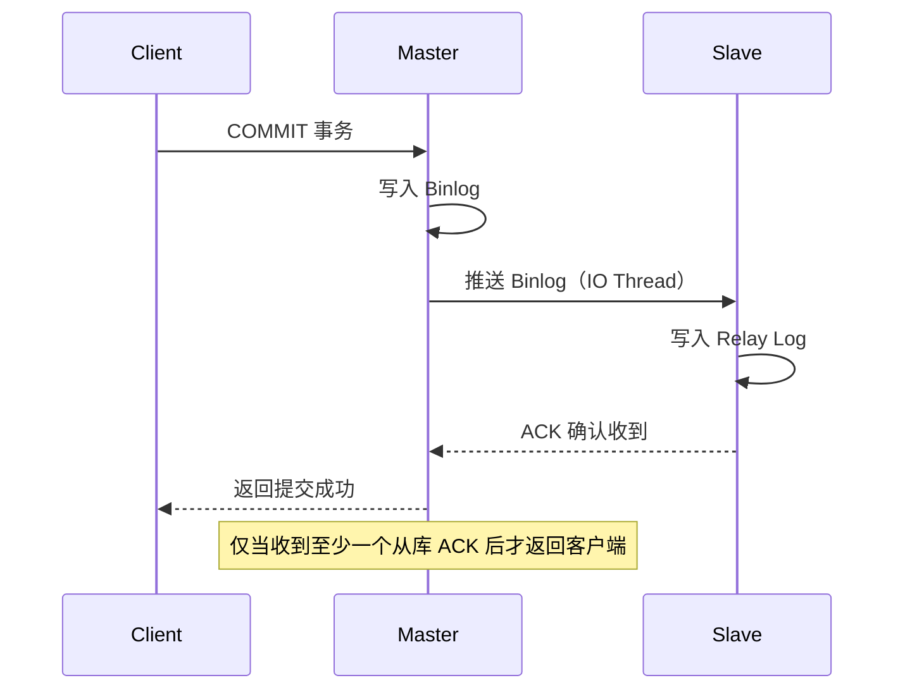
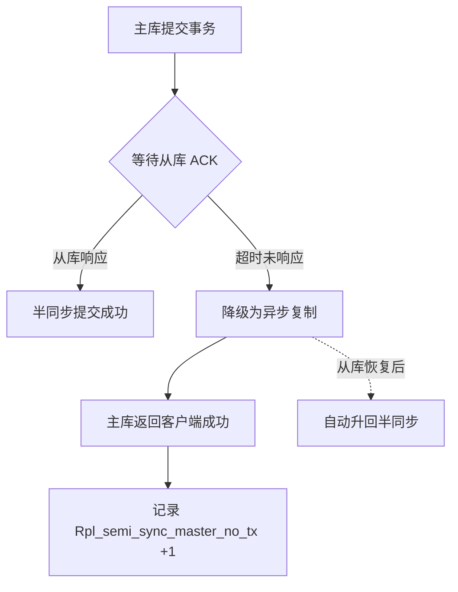

> [!abstract] 文档说明
> 半同步复制（Semi-Synchronous Replication）是介于异步复制和全同步复制之间的折中方案：主库提交事务时，至少等待一个从库确认收到 Binlog 后才返回客户端。本笔记涵盖原理、安装、配置、监控与降级机制。
>
> 适用版本：MySQL 5.7+，生产推荐 8.0

## 为什么需要半同步

回顾三种复制模式的权衡：

| 模式 | 主库等待 | 数据安全 | 性能 | 丢数据风险 |
|------|----------|----------|------|-----------|
| 异步复制 | 不等待 | 低 | 最高 | 可能丢失 |
| 半同步复制 | 等待 ≥1 个从库收到 | 中高 | 中等 | 极低 |
| 全同步复制 | 等待所有从库确认 | 最高 | 最低 | 不会丢失 |

> [!warning] 异步复制的风险
> MySQL 主从复制操作手册中默认配置的是异步复制。主库写入 Binlog 后立即返回客户端，如果从库 IO 线程还没拉取日志，此时主库宕机，这部分数据就会丢失。对数据一致性要求高的场景（如金融、交易）应使用半同步复制。

## 半同步复制原理



### AFTER_COMMIT vs AFTER_SYNC

MySQL 5.7+ 提供两种半同步模式：

| 模式 | 参数值 | 行为 | 特点 |
|------|--------|------|------|
| AFTER_COMMIT | 1（默认） | 主库先提交事务，再等待从库 ACK | 主库宕机可能幻读（从库未收到但主库已提交） |
| AFTER_SYNC | 2 | 主库先等待从库 ACK，再提交事务 | 无幻读风险，更安全（MySQL 8.0 推荐） |

> [!tip] AFTER_SYNC 更安全
> `AFTER_SYNC`（即 LOSSLESS SEMI-SYNC）确保从库收到 Binlog 后主库才提交，避免了"主库已提交但从库未收到"的幻读问题。MySQL 8.0 推荐使用此模式。

## 安装半同步插件

半同步复制通过插件实现，需要分别在主库和从库安装。

### 主库安装

```sql
-- 安装主库端插件
INSTALL PLUGIN rpl_semi_sync_master SONAME 'semisync_master.so';

-- 验证安装
SELECT PLUGIN_NAME, PLUGIN_STATUS
FROM information_schema.PLUGINS
WHERE PLUGIN_NAME LIKE 'rpl_semi_sync%';
```

### 从库安装

```sql
-- 安装从库端插件
INSTALL PLUGIN rpl_semi_sync_slave SONAME 'semisync_slave.so';

-- 验证
SELECT PLUGIN_NAME, PLUGIN_STATUS
FROM information_schema.PLUGINS
WHERE PLUGIN_NAME LIKE 'rpl_semi_sync%';
```

> [!note] 插件文件名
> - Linux：`semisync_master.so` / `semisync_slave.so`
> - Windows：`semisync_master.dll` / `semisync_slave.dll`
>
> 插件文件位于 MySQL 安装目录的 `lib/plugin/` 下。如果找不到，检查 MySQL 是否安装了完整版（非精简版）。

## 配置半同步

### 主库配置

```ini
# my.cnf
[mysqld]
# 开启半同步主库
rpl_semi_sync_master_enabled = 1
# 等待 ACK 的超时时间（毫秒），超时后降级为异步
rpl_semi_sync_master_timeout = 3000
# 使用 AFTER_SYNC 模式（无损半同步）
rpl_semi_sync_master_wait_point = AFTER_SYNC
```

```sql
-- 也可在线动态设置
SET GLOBAL rpl_semi_sync_master_enabled = 1;
SET GLOBAL rpl_semi_sync_master_timeout = 3000;
SET GLOBAL rpl_semi_sync_master_wait_point = AFTER_SYNC;
```

### 从库配置

```ini
# my.cnf
[mysqld]
# 开启半同步从库
rpl_semi_sync_slave_enabled = 1
```

```sql
-- 在线动态设置
SET GLOBAL rpl_semi_sync_slave_enabled = 1;
```

> [!warning] 从库需要重启 IO 线程
> 如果从库已经在运行异步复制，开启半同步后需要重启 IO 线程才能让从库以半同步模式注册到主库：
> ```sql
> STOP SLAVE IO_THREAD;
> START SLAVE IO_THREAD;
> ```

### 完整配置流程

```sql
-- === 主库 ===
INSTALL PLUGIN rpl_semi_sync_master SONAME 'semisync_master.so';
SET GLOBAL rpl_semi_sync_master_enabled = 1;
SET GLOBAL rpl_semi_sync_master_timeout = 3000;
SET GLOBAL rpl_semi_sync_master_wait_point = AFTER_SYNC;

-- 验证
SHOW VARIABLES LIKE 'rpl_semi_sync_master%';

-- === 从库 ===
INSTALL PLUGIN rpl_semi_sync_slave SONAME 'semisync_slave.so';
SET GLOBAL rpl_semi_sync_slave_enabled = 1;

-- 重启 IO 线程使半同步生效
STOP SLAVE IO_THREAD;
START SLAVE IO_THREAD;
```

## 监控半同步状态

### 主库状态

```sql
SHOW STATUS LIKE 'Rpl_semi_sync_master%';
```

关键状态变量：

| 状态变量 | 含义 |
|----------|------|
| `Rpl_semi_sync_master_status` | `ON` 表示半同步已激活 |
| `Rpl_semi_sync_master_clients` | 已连接的半同步从库数量 |
| `Rpl_semi_sync_master_yes_tx` | 成功收到 ACK 的事务数 |
| `Rpl_semi_sync_master_no_tx` | 超时降级为异步的事务数 |
| `Rpl_semi_sync_master_net_avg_wait_time` | 平均等待 ACK 的时间（微秒） |

> [!success] 健康检查
> `Rpl_semi_sync_master_status = ON` 且 `Rpl_semi_sync_master_clients >= 1`，说明半同步正常运行。如果 `Rpl_semi_sync_master_no_tx` 持续增长，说明从库响应太慢，频繁降级为异步。

### 从库状态

```sql
SHOW STATUS LIKE 'Rpl_semi_sync_slave%';
```

| 状态变量 | 含义 |
|----------|------|
| `Rpl_semi_sync_slave_status` | `ON` 表示以半同步模式运行 |

## 降级机制

半同步复制有一个重要的"安全阀"：当从库在超时时间内没有返回 ACK 时，主库会自动降级为异步复制，以保证业务不被阻塞。



> [!danger] 降级的双面性
> 降级机制保证了业务连续性（不会因为从库故障而卡住主库写入），但也意味着数据安全级别临时下降。如果降级期间主库宕机，仍然会丢数据。生产环境应配合告警监控 `Rpl_semi_sync_master_no_tx`，一旦增长立即排查从库。

### 超时时间调优

```sql
-- 查看当前超时时间（毫秒）
SHOW VARIABLES LIKE 'rpl_semi_sync_master_timeout';
```

| 场景 | 推荐值 | 说明 |
|------|--------|------|
| 低延迟内网 | 1000ms（1秒） | 从库响应快，快速降级 |
| 跨机房/同城专线 | 3000ms（3秒） | 留足网络往返时间 |
| 跨地域 | 5000-10000ms | 网络延迟较大 |

> [!tip] 多从库 ACK 策略
> MySQL 5.7+ 支持配置需要多少个从库 ACK 才算成功：
> ```sql
> SET GLOBAL rpl_semi_sync_master_wait_for_slave_count = 1;  -- 默认 1 个
> ```
> 如果有多个从库，可以设为 2，要求至少 2 个从库确认。但这会增加等待时间。

## 常见问题

### 问题 1：半同步一直显示 OFF

```sql
-- 主库查看
SHOW STATUS LIKE 'Rpl_semi_sync_master_status';
-- 如果为 OFF，检查：
```

排查步骤：

1. 从库插件是否安装：`SHOW PLUGINS` 检查 `rpl_semi_sync_slave` 状态
2. 从库是否启用：`SHOW VARIABLES LIKE 'rpl_semi_sync_slave_enabled'`
3. 从库 IO 线程是否运行：`SHOW SLAVE STATUS\G` 检查 `Slave_IO_Running`
4. 从库 IO 线程是否在半同步插件安装后重启过

> [!warning] 最常见的原因
> 从库已安装插件并设置了 `rpl_semi_sync_slave_enabled = 1`，但**没有重启 IO 线程**。从库以异步模式注册到主库，主库认为没有半同步从库，因此状态为 OFF。解决：`STOP SLAVE IO_THREAD; START SLAVE IO_THREAD;`

### 问题 2：主库写延迟增大

半同步复制会增加主库写入延迟（需等待从库 ACK）。优化方向：

- 降低 `rpl_semi_sync_master_timeout`，让降级更快触发
- 提升从库 IO 性能（SSD、更大内存）
- 使用 `AFTER_SYNC` 模式（比 `AFTER_COMMIT` 延迟更低）
- 确保主从间网络延迟低（同城机房 < 1ms）

## 完整配置参考

```ini
# === 主库 my.cnf ===
[mysqld]
plugin_load = "rpl_semi_sync_master=semisync_master.so"
rpl_semi_sync_master_enabled = 1
rpl_semi_sync_master_timeout = 3000
rpl_semi_sync_master_wait_point = AFTER_SYNC
rpl_semi_sync_master_wait_for_slave_count = 1

# === 从库 my.cnf ===
[mysqld]
plugin_load = "rpl_semi_sync_slave=semisync_slave.so"
rpl_semi_sync_slave_enabled = 1
```

## 相关文档

- MySQL 主从复制操作手册
- MySQL Binlog 详解
- MySQL GTID 原理与实践
- MySQL 读写分离方案

---

> [!quote] 最后更新
> 2026-09-03 | 基于 MySQL 8.0
